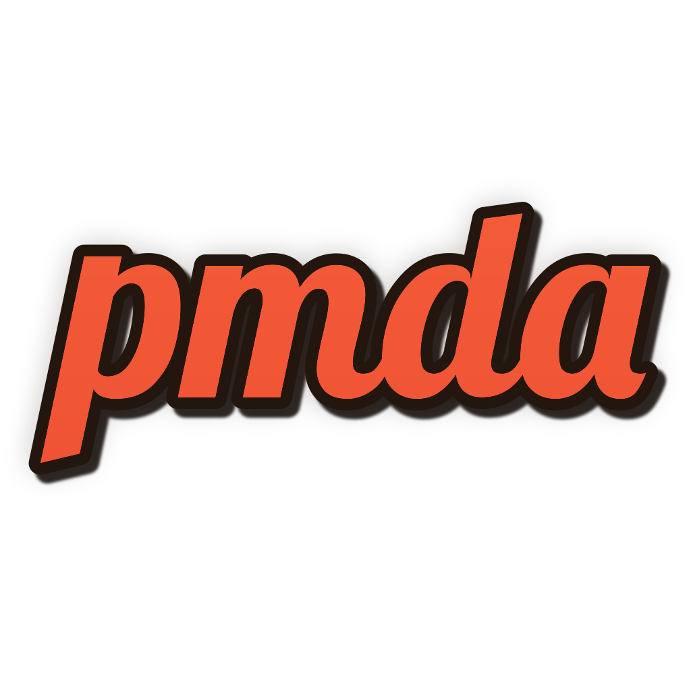
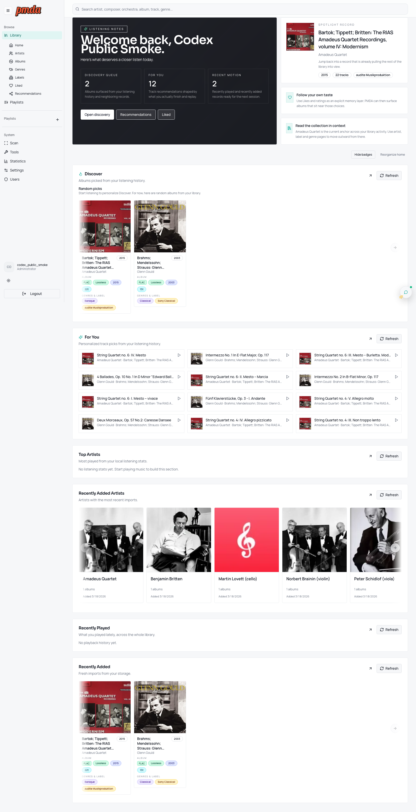
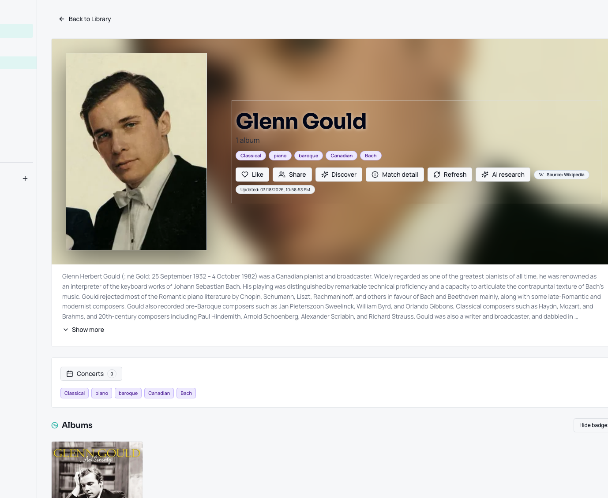
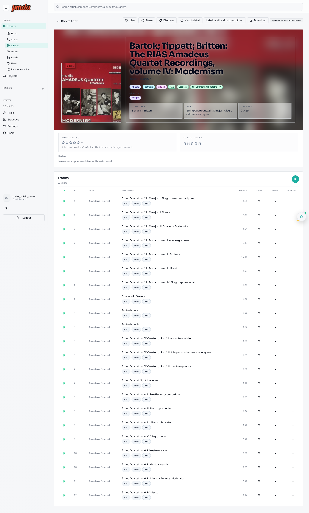

<div align="center">
  

### AI-assisted music library matching, cleanup, playback, and discovery for large self-hosted collections.

<p>
  
  
  
  
  
  
</p>

<p>
  <a href="https://hub.docker.com/r/meaning/pmda"></a>
  <a href="docs/USER_GUIDE.md"></a>
  <a href="docs/ARCHITECTURE.md"></a>
  <a href="https://discord.gg/2jkwnNhHHR"></a>
</p>
</div>

---

## Quick Start (Docker)

PMDA ships as a single container with the web app, PostgreSQL, and Redis already inside.

```bash
docker run -d \
  --name pmda \
  --restart unless-stopped \
  -p 5005:5005 \
  -e PMDA_AUTH_ENABLED=1 \
  -e PMDA_MEDIA_CACHE_ROOT=/cache \
  -v /srv/pmda/config:/config \
  -v /srv/pmda/cache:/cache \
  -v /srv/music:/music:rw \
  -v /srv/pmda/review:/dupes:rw \
  -v /srv/pmda/export:/export:rw \
  meaning/pmda:latest
```

Open `http://localhost:5005`, create your admin account, then configure in **Settings**:

1. one or more **Standard source folders**
2. optional **Incoming folders**
3. **Duplicates** and **Incomplete** targets
4. optional **Export** root and AI providers

PMDA is ready to scan as soon as folders are configured.

## What PMDA Does

| | |
|---|---|
| 🔎 **Match albums** | Cross-check tags, track structure, durations, AcoustID, MusicBrainz, Discogs, Last.fm, and Bandcamp. |
| 🧠 **Use OCR and AI only when needed** | Read covers with Tesseract, confirm ambiguous art with vision, and use web search for missing reviews or context. |
| ♻️ **Clean the library** | Detect duplicates, identify incomplete albums, move them to review folders, and keep everything reversible. |
| ⚡ **Publish a fast catalog** | Serve a PostgreSQL-backed library with Redis hot cache and SSD-backed artwork/media cache. |
| ▶️ **Play and share** | Browse, play, like, rate, build playlists, recommend albums, and compare listening taste across users. |
| 🧱 **Export anywhere** | Build a clean hardlinked, symlinked, copied, or moved export tree for Plex, Jellyfin, or Navidrome. |

## Screenshots

### Library Home



### Artist Page



### Album Page



## Core Capabilities

- Multi-folder source management with optional incoming/drop-zone workflows
- Automatic duplicate detection with restorable move history
- Automatic incomplete-album detection and quarantine
- Classical-aware matching for composer, work, conductor, orchestra, ensemble, and soloists
- Review surfaces for duplicates, incompletes, pipeline trace, and scan history
- Built-in player, playlists, likes, recommendations, concerts, and user accounts
- Mobile-friendly web UI and installable PWA shell
- Exported library generation for downstream media servers

## Metadata, OCR, and AI

**Metadata providers**
- MusicBrainz
- Discogs
- Last.fm
- Bandcamp
- AcoustID

**AI providers**
- OpenAI API
- OpenAI Codex runtime
- Anthropic
- Google Gemini
- Ollama

PMDA uses deterministic signals first, then escalates to OCR, vision, or LLMs only when ambiguity remains or advanced enrichment is enabled.

## Integrations

PMDA can be used in two ways:

- **Primary app**: PMDA scans, matches, publishes, plays, and recommends directly.
- **Middleware**: PMDA cleans and exports a library that Plex, Jellyfin, or Navidrome can index downstream.

## Best Fit

PMDA is designed for serious self-hosted music libraries:

- large collections
- mixed metadata quality
- duplicate-heavy or incomplete-heavy sources
- users who want automation without losing reviewability
- users who want a faster published library than raw folder browsing

## Documentation

- [User guide](docs/USER_GUIDE.md)
- [Architecture](docs/ARCHITECTURE.md)
- [Configuration](docs/CONFIGURATION.md)
- [Unraid Community Apps template](https://github.com/silkyclouds/PMDA_unraid_xml/blob/main/pmda.xml)
- [Documentation hub](docs/README.md)
- [Discord](https://discord.gg/2jkwnNhHHR)

## Docker Images

- `meaning/pmda:latest`
- `meaning/pmda:beta`

Docker Hub: [meaning/pmda](https://hub.docker.com/r/meaning/pmda)
