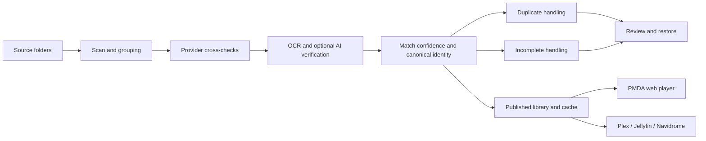

# PMDA

<p align="center">
  
</p>

<p align="center">
  <strong>AI-assisted music library matching, cleanup, playback, and discovery for large self-hosted collections.</strong>
</p>

<p align="center">
  <a href="https://hub.docker.com/r/meaning/pmda">Docker Hub</a>
  ·
  <a href="https://github.com/silkyclouds/PMDA">GitHub</a>
  ·
  <a href="docs/USER_GUIDE.md">User Guide</a>
  ·
  <a href="docs/ARCHITECTURE.md">Architecture</a>
</p>

---

PMDA did not start as a full music platform.

It started because a large Plex music library had duplicate covers, duplicate albums, inconsistent tags, and too many manual fixes. The original tool only existed to spot duplicate albums. PMDA now goes far beyond that:

- it matches albums across multiple metadata providers
- it identifies and quarantines incomplete releases
- it builds a fast published library on top of PostgreSQL, Redis, and an SSD-backed media cache
- it can export a clean hardlinked or symlinked library for Plex, Jellyfin, or Navidrome
- it includes its own player, social features, recommendations, scan history, and review workflows

PMDA is designed for people with serious music libraries who want automation, confidence, reviewability, and speed.

It is not aimed at tiny collections or ultra-low-power hardware.

## Screenshots

### Library Home


### Artist Page


### Album Page


## What PMDA Is Now

PMDA is a self-hosted music library system with five major jobs:

1. **Identify and normalize albums**
2. **Detect duplicates and incomplete releases**
3. **Publish a cleaner, faster library**
4. **Let users browse, play, like, share, and recommend**
5. **Keep the whole process auditable and reversible**

It can act as:

- a primary music web app
- a matching and cleanup middleware in front of Plex, Jellyfin, or Navidrome
- a library publishing pipeline that generates a clean export tree from messy source folders

## Core Capabilities

### 1. Matching and Metadata Enrichment

PMDA matches albums using a layered pipeline instead of trusting raw tags blindly.

Signals include:

- local file tags
- track structure and durations
- audio fingerprints via AcoustID
- MusicBrainz
- Discogs
- Last.fm
- Bandcamp
- cover OCR with Tesseract
- optional AI vision checks for cover confirmation
- optional web search for reviews and missing context

The matching pipeline is built to cross-check providers instead of accepting the first answer that looks plausible.

### 2. Duplicate Detection and Review

PMDA can:

- detect duplicate albums
- choose a preferred winner
- move duplicate losers to a reviewable duplicates folder
- preserve a full move history
- restore duplicate moves later if needed

This is the feature PMDA originally existed for, but it is now part of a much larger pipeline.

### 3. Incomplete Album Detection

PMDA also identifies broken or incomplete albums, including cases such as:

- missing tracks
- broken folder structure
- incomplete multi-disc releases
- unreadable or invalid audio sets

Incomplete albums can be moved to a dedicated quarantine folder for review and later restoration.

### 4. Classical-Aware Matching

PMDA has dedicated logic for classical music and does not treat it like a generic pop library.

It can disambiguate using combinations of:

- composer
- work
- conductor
- orchestra
- ensemble
- soloists and performers
- edition and packaging cues from covers

This is crucial for libraries where different interpretations of the same work must stay separate while true duplicates still collapse correctly.

### 5. Player, Social Layer, and Discovery

PMDA is also a music app.

It includes:

- web playback
- playlists
- likes on tracks, albums, artists, labels, and genres
- shared recommendations between users
- artist pages with similar artists and concerts
- personalized recommendation surfaces
- Last.fm support and scrobbling hooks

The goal is not only to clean a library, but to make that library more navigable and more social.

### 6. Exported Library / Middleware Mode

PMDA can generate an exported library with a predictable structure and link strategy:

- hardlink
- symlink
- copy
- move

That exported tree can then be pointed at:

- Plex
- Jellyfin
- Navidrome

This means PMDA can sit in front of another media server as the matching, dedupe, incomplete-filtering, and publishing layer.

### 7. Review, History, and Statistics

PMDA keeps the process reviewable.

It includes:

- scan history
- duplicate review
- incomplete review
- move restoration
- pipeline tracing
- library statistics
- listening statistics
- cache and system statistics

The intent is to avoid forcing users to inspect raw logs just to understand what PMDA did.

## How The Pipeline Works



In practice, the workflow is:

1. PMDA scans one or more source folders.
2. It groups folders into album candidates.
3. It cross-checks tags, structure, providers, OCR, and optional AI signals.
4. It decides what the album is, whether it is complete, and whether it is a duplicate.
5. It publishes a fast browsable library and media cache.
6. It keeps review surfaces for duplicate and incomplete actions.

## Built For Large Libraries

PMDA is optimized for large, messy, real-world collections.

That is why it uses:

- **PostgreSQL** for a fast, query-heavy library database
- **Redis** for hot cache paths
- **an SSD-backed media cache** for responsive cover and artist image delivery
- **RAM artwork caching** for frequently requested assets
- **batched and throttled AI calls** to keep cost and latency under control

If your workflow is "a few thousand albums on a Raspberry Pi and I do the rest by hand", PMDA is probably overkill.

If your workflow is "my library is large, heterogeneous, and I want the machine to do the hard cleanup and matching work for me", PMDA is built for that.

## Architecture

PMDA currently ships as a self-contained stack:

- **Backend:** Flask
- **Frontend:** React + TypeScript + Vite
- **Primary data store:** PostgreSQL
- **Hot cache:** Redis
- **Media cache:** filesystem cache with artwork and derived assets
- **OCR:** Tesseract
- **Audio tooling:** FFmpeg + AcoustID / Chromaprint
- **AI providers:** OpenAI, Anthropic, Google Gemini, Ollama

The default Docker image already bundles PostgreSQL and Redis so you can start with one container.

## Providers and Cross-Checks

### Metadata providers

- MusicBrainz
- Discogs
- Last.fm
- Bandcamp
- AcoustID

### AI providers

- OpenAI API
- OpenAI Codex OAuth runtime
- Anthropic
- Google Gemini
- Ollama

PMDA uses local and deterministic signals first where possible, then escalates to AI only when ambiguity remains or when advanced enrichment is explicitly enabled.

## Quick Start (Docker)

The simplest way to start PMDA is with the all-in-one container.

It exposes the web UI on port `5005` and runs PostgreSQL + Redis inside the container by default.

```bash
docker run -d \
  --name pmda \
  --restart unless-stopped \
  -p 5005:5005 \
  -v /path/to/pmda-config:/config \
  -v /path/to/music:/music:rw \
  -v /path/to/dupes:/dupes:rw \
  meaning/pmda:latest
```

Open:

- `http://localhost:5005`

Then use the Settings UI to configure:

- source folders
- optional incoming folders
- duplicate destination
- incomplete destination
- exported library root
- AI providers
- auth and users
- optional Plex / Jellyfin / Navidrome downstream usage

### Recommended optional SSD cache mount

If you want the media cache on a faster disk:

```bash
docker run -d \
  --name pmda \
  --restart unless-stopped \
  -p 5005:5005 \
  -e PMDA_MEDIA_CACHE_ROOT=/cache \
  -v /path/to/pmda-config:/config \
  -v /path/to/music:/music:rw \
  -v /path/to/dupes:/dupes:rw \
  -v /path/to/ssd-cache:/cache:rw \
  meaning/pmda:latest
```

## Typical Deployments

### PMDA as the primary music app

Use PMDA for:

- scanning
- matching
- cleanup
- playback
- recommendations
- sharing and likes

### PMDA as middleware for another player

Use PMDA to:

- scan messy source folders
- dedupe and quarantine incomplete albums
- generate an exported hardlinked or symlinked library
- point Plex, Jellyfin, or Navidrome at that exported library

This gives you a cleaner downstream media server without manually rebuilding your collection.

## Why PMDA Exists

PMDA exists because large music libraries accumulate problems:

- duplicate editions
- broken or incomplete folders
- weak tags
- missing covers
- missing artist context
- inconsistent classical metadata
- no good review surface after automation

PMDA is the answer to that class of problem.

It uses automation and AI where they help, but it keeps review, reversibility, and history because blind automation is not good enough for serious collections.

## Current Product Scope

Today, PMDA includes:

- multi-folder source management
- optional incoming/drop-zone workflows
- duplicate and incomplete handling
- exported library generation
- artwork and artist image caching
- user accounts and permissions
- likes and social recommendation flows
- artist and album pages
- statistics and pipeline trace surfaces
- mobile-friendly web app shell

This is no longer "just a Plex dedupe helper".

## Documentation

- [User guide](docs/USER_GUIDE.md)
- [French user guide](docs/USER_GUIDE_FR.md)
- [Architecture](docs/ARCHITECTURE.md)
- [French architecture](docs/ARCHITECTURE_FR.md)
- [Configuration](docs/CONFIGURATION.md)
- [French configuration](docs/CONFIGURATION_FR.md)

## Docker Images

- `meaning/pmda:latest`
- `meaning/pmda:beta`

Docker Hub:

- <https://hub.docker.com/r/meaning/pmda>

## Repository

- <https://github.com/silkyclouds/PMDA>
