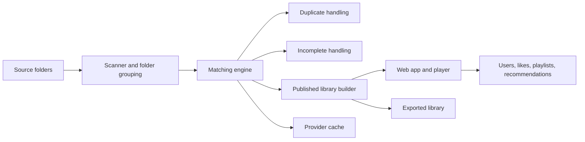
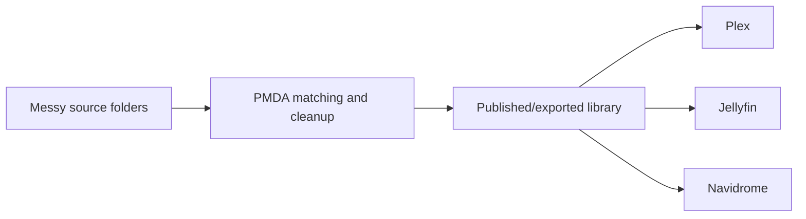

# PMDA Architecture

PMDA is a music library pipeline and web application built to process large collections end to end.

Support: [Discord](https://discord.gg/2jkwnNhHHR)

---

## 1. System Overview

PMDA has four major layers:

1. **Ingest**: scan files and build album candidates
2. **Decision**: match albums and decide what is complete, duplicated, or publishable
3. **Publication**: publish metadata, artwork, and the normalized library state
4. **Consumption**: browsing, playback, recommendations, sharing, and exports

---

## 2. Runtime Components

### Backend

- Python / Flask application
- scan pipeline
- matching logic
- review tools
- API used by the React frontend

### Frontend

- React + TypeScript + Vite
- library surfaces, detail pages, player, settings, statistics, admin pages
- responsive web app with mobile PWA behavior

### Primary data store

- PostgreSQL stores the published library, users, likes, playlists, stats, and pipeline state

### Hot cache

- Redis caches hot paths and accelerates API-backed UI surfaces

### Media cache

- filesystem-backed artwork/media cache
- optimized for SSD/NVMe
- stores promoted, resized, and derived assets so PMDA does not keep re-reading slow source disks

### OCR and media tooling

- Tesseract for cover OCR
- FFmpeg and Chromaprint/AcoustID for audio inspection and fingerprinting

---

## 3. Data Flow

### Stage 1: Source discovery

PMDA reads configured folder roles:

- Standard source folders
- Incoming folders
- Duplicates target
- Incomplete target
- Export root

It builds an active scan set from enabled source roles.

### Stage 2: Album candidate grouping

Files are grouped into album candidates using:

- folder structure
- audio file membership
- disc structure
- track numbering
- embedded and sidecar metadata

### Stage 3: Matching

Each album candidate is scored against available identities.

Signals can include:

- local tags
- normalized album and artist strings
- track titles
- track counts
- disc counts
- durations
- audio fingerprints
- provider IDs already present in files
- provider metadata fetched during the scan
- OCR extracted from covers or embedded artwork
- optional AI vision and web search

### Stage 4: Decision

PMDA decides whether the candidate is:

- a valid publishable album
- a duplicate of another album already seen or published
- an incomplete or structurally broken album
- still too uncertain and in need of manual review or later enrichment

### Stage 5: Publication

PMDA publishes:

- normalized album rows
- track rows
- artist/composer/conductor/orchestra/ensemble entities
- artwork references and cached assets
- player-ready metadata
- recommendation-ready metadata

### Stage 6: Review and restore

Every destructive move is kept reviewable.

PMDA records:

- duplicate moves
- incomplete moves
- pipeline trace rows
- scan history
- restore information

---

## 4. Matching Engine

PMDA does not trust a single provider or a single signal.

### Provider layer

PMDA can use:

- MusicBrainz
- Discogs
- Last.fm
- Bandcamp
- AcoustID

These are cross-checked rather than blindly accepted.

### Local signal layer

PMDA also relies on:

- filename and folder structure
- track and disc numbering
- durations and total running time
- embedded IDs and tags
- artwork found in folders or inside files

### OCR layer

PMDA can extract text from:

- front covers
- back covers
- embedded artwork
- booklet/insert images when available

OCR helps detect:

- printed label names
- catalog numbers
- composer/work names
- conductors and orchestras
- edition clues

### AI layer

AI is not the first step. It is an escalation path.

PMDA uses AI when local/provider/OCR signals still leave ambiguity.

AI tasks can include:

- disambiguating close candidates
- confirming cover consistency
- generating artist or album summaries
- finding missing reviews through web search
- extracting richer context for artist pages

This reduces unnecessary cost while improving hard cases.

---

## 5. Classical-Aware Matching

Classical music requires a different model than pop or rock.

PMDA can promote and disambiguate entities such as:

- composer
- work
- conductor
- orchestra
- ensemble
- soloists and performers
- edition/reissue cues

This matters because PMDA must:

- keep different interpretations of the same work separate
- collapse only true duplicate editions of the same recording
- enrich composers and interpreters as first-class browseable entities

---

## 6. Duplicate and Incomplete Handling

### Duplicate handling

PMDA identifies duplicate groups, picks a winner, and can move loser editions to the duplicates target.

The decision can consider:

- format quality
- completeness
- provider confidence
- edition quality
- artwork and tag quality
- local preferences and rules

### Incomplete handling

PMDA can isolate albums that are incomplete because of:

- missing tracks
- broken disc structure
- inconsistent numbering
- missing critical files
- invalid or unreadable source material

Both flows remain reversible.

---

## 7. Published Library Model

PMDA’s published library is not just a raw directory listing.

It is a normalized state designed for:

- fast UI browsing
- reliable search
- recommendation features
- social features
- mobile playback surfaces
- export generation

The published state contains enough metadata to avoid re-hitting slow sources for common reads.

---

## 8. Export Library Model

PMDA can publish a clean downstream tree using:

- hardlink
- symlink
- copy
- move

This makes PMDA usable as a middleware layer.

---

## 9. User and Social Layer

PMDA supports:

- user accounts
- roles and permissions
- likes
- playlists
- recommendations
- shared browsing of the same library

This sits on top of the published library rather than being bolted onto raw folders.

---

## 10. Performance Strategy

PMDA is optimized for large libraries.

### Core principles

- keep the canonical state in PostgreSQL
- cache hot paths in Redis
- keep artwork and derived media assets in SSD-backed cache
- reduce cold reads from slow source disks
- batch and cache AI work where possible
- prefer OCR and deterministic signals before escalating to AI

### Why this matters

Large libraries usually fail when every page read or scan step keeps:

- hitting raw spinning disks
- re-reading the same artwork
- re-querying the same providers
- re-running the same AI checks

PMDA avoids that model.

---

## 11. Public Deployment Model

Recommended public deployment:

- PMDA auth enabled
- HTTPS via reverse proxy or Cloudflare Tunnel
- PMDA behind app-level rate limiting and lockouts
- media served through PMDA, not through LAN-only backend URLs

This keeps the published app usable from web, PWA, and future mobile clients.

---

## 12. Operational Surfaces

Admins can inspect:

- scan history
- pipeline trace
- duplicate review
- incomplete review
- library statistics
- listening statistics
- system/cache behavior
- user management

These surfaces exist so PMDA remains inspectable, not opaque.
