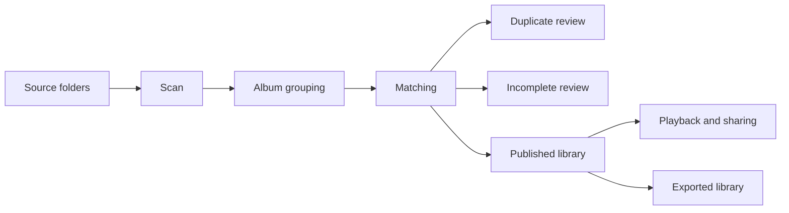

# PMDA User Guide

PMDA scans music folders, matches albums, isolates duplicates and incomplete releases, publishes a faster library, and gives users a music app on top of it.

Support: [Discord](https://discord.gg/2jkwnNhHHR)

---

## 1. What PMDA Does

PMDA combines five jobs in one system:

1. **Scan** source folders and group files into album candidates
2. **Match** albums using tags, structure, provider metadata, OCR, and optional AI
3. **Clean** the library by moving duplicates and incomplete releases into review folders
4. **Publish** a faster, normalized library backed by PostgreSQL, Redis, and an artwork cache
5. **Play and share** through the built-in web app with playlists, likes, recommendations, and user accounts

---

## 2. First Launch

### Recommended Docker start

```bash
docker run -d \
  --name pmda \
  --restart unless-stopped \
  -p 5005:5005 \
  -e PMDA_AUTH_ENABLED=1 \
  -e PMDA_MEDIA_CACHE_ROOT=/cache \
  -v /srv/pmda/config:/config \
  -v /srv/pmda/cache:/cache \
  -v /srv/music:/music:rw \
  -v /srv/pmda/review:/dupes:rw \
  -v /srv/pmda/export:/export:rw \
  meaning/pmda:latest
```

Open `http://localhost:5005`, create the admin user, then go to **Settings**.

### Minimum folder setup

You usually configure:

- one or more **Standard source folders**
- zero or more **Incoming folders**
- a **Duplicates** target
- an **Incomplete albums** target
- optionally an **Export root**
- optionally an **Artwork/media cache** root on SSD/NVMe

### Folder roles

- **Standard source folder**: music already part of your main collection
- **Incoming folder**: drop zone for fresh downloads or manual imports
- **Duplicates target**: where loser editions are moved for review
- **Incomplete target**: where broken or missing-track releases are moved
- **Export root**: the clean generated library for Plex/Jellyfin/Navidrome or direct use

---

## 3. Typical Workflow



### What usually happens

1. PMDA scans your configured folders.
2. It groups tracks into album candidates.
3. It matches those albums against providers and local signals.
4. It chooses a canonical identity for each album.
5. It moves duplicates and incompletes out of the published set.
6. It refreshes the published library, metadata cache, and player surfaces.
7. You review anything that was moved, restore if needed, and keep going.

---

## 4. Running Scans

Go to **Scan** or use the scan entry points in the main UI.

### Scan types

- **Library scan**: scans your configured standard sources
- **Incoming scan**: focuses on incoming/drop-zone folders
- **Resume scan**: continues a paused or interrupted run

### During a scan

PMDA records:

- progress
- current folder/album
- matches and confidence
- duplicate actions
- incomplete actions
- export and player sync events
- pipeline trace rows for admin review

### After a scan

Check:

- **Statistics** for coverage and scan summary
- **Tools** for duplicate and incomplete review
- **Pipeline** trace to see what happened to each folder or album

---

## 5. Reviewing Results

### Duplicates

PMDA can automatically choose a winner and move loser editions to the duplicates target.

Use review tools to:

- inspect what was considered a duplicate
- restore moved folders
- confirm that the preferred edition was correct

### Incomplete albums

PMDA can move albums that are structurally incomplete or missing critical tracks.

Use review tools to:

- inspect the reason an album was considered incomplete
- restore it if PMDA was too strict
- rerun matching after fixing the source material

### Pipeline trace

Admins can inspect a per-folder/per-album trace showing:

- source folder
- provider hits
- match result
- duplicate status
- incomplete status
- move/export actions
- final publication outcome

---

## 6. Using the Library

### Browse

PMDA exposes:

- Home
- Albums
- Artists
- Genres
- Labels
- Liked
- Recommendations
- Playlists

### Artist pages

Artist pages can include:

- image
- biography
- albums
- similar artists
- concerts
- collaborations and facts
- likes and social signals

### Album pages

Album pages can include:

- hero artwork
- match detail
- track list
- review snippet
- user rating
- public pulse
- artwork gallery
- label, year, format, edition metadata

### Search

Global search can surface:

- artists
- composers
- conductors
- orchestras
- ensembles
- albums
- tracks
- genres
- labels

---

## 7. Playback

PMDA includes a built-in player with:

- album playback
- queueing
- track selection
- likes
- playlist insertion
- mobile PWA shell
- full-screen mobile now playing

### Mobile web app

Installed as a PWA, PMDA can provide:

- bottom navigation on mobile
- full-screen now playing
- lock-screen metadata where the browser allows it
- a usable bridge before a dedicated native app exists

---

## 8. Sharing and Social Features

PMDA supports multiple users.

Users can:

- browse the same published library
- like albums, artists, labels, genres, and tracks
- inspect what other users liked
- follow recommendation surfaces shaped by listening and likes
- build local playlists

Admins can:

- create and manage users
- control who can use AI-heavy features
- expose the app publicly through a reverse proxy or Cloudflare Tunnel

---

## 9. Exported Library Mode

PMDA can generate a clean library tree using:

- hardlinks
- symlinks
- copy
- move

The exported library is useful when you want PMDA to do the cleanup work but still use:

- Plex
- Jellyfin
- Navidrome

Typical export layout:

```text
/export/
  A/
    Artist Name/
      2024 - Album Title/
        01 Track.flac
        02 Track.flac
```

---

## 10. AI and Metadata Enrichment

PMDA does not rely only on raw tags.

It can combine:

- file tags
- track structure
- durations
- audio fingerprints
- MusicBrainz
- Discogs
- Last.fm
- Bandcamp
- OCR from covers
- optional AI vision confirmation
- optional web search for missing reviews or context

Use AI providers when you want:

- harder disambiguation
- better classical matching
- richer reviews and summaries
- better cover confirmation

PMDA is also designed to reduce unnecessary AI calls through batching, caching, OCR-first logic, and provider cross-checks.

---

## 11. Tips

- Put the artwork/media cache on SSD or NVMe.
- Keep source folders and review targets mounted with stable paths.
- Use incoming folders only if you really have a separate drop zone.
- Review duplicate and incomplete moves after the first large scan.
- Use exported library mode when you want Plex/Jellyfin/Navidrome downstream.
- If exposing PMDA publicly, enable auth and run it behind HTTPS.

---

## 12. Troubleshooting

### The scan sees too few albums

Check:

- source folders are enabled
- the selected winner/export root is correct
- review folders are not mistakenly used as sources
- files are actually mounted inside the container

### Album covers or artist images are missing

Check:

- media cache root is writable
- provider metadata exists
- the source material has embedded or folder artwork
- OCR/AI features are enabled only if you intend to use them

### Public access is slow or inconsistent

Check:

- media cache is on SSD/NVMe
- PMDA is behind a clean reverse proxy or Cloudflare Tunnel
- the browser is not trying to fetch LAN resources directly

### Matching feels too conservative or too aggressive

Check:

- AI usage level
- provider availability
- OCR availability
- scan settings and source folder quality

For deployment-level details, read [CONFIGURATION.md](CONFIGURATION.md).
